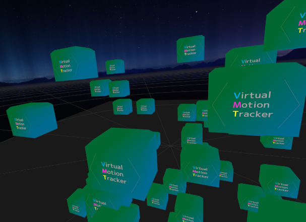
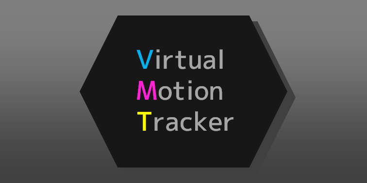

# VMT - Virtual Motion Tracker

## [Official page and Manual](https://gpsnmeajp.github.io/VirtualMotionTrackerDocument/)
### [API Reference](https://gpsnmeajp.github.io/VirtualMotionTrackerDocument/api/)
### [Sample Code](https://gpsnmeajp.github.io/VirtualMotionTrackerDocument/sample/)
### [Download Binaly](https://gpsnmeajp.github.io/VirtualMotionTrackerDocument/download/)

An easy-to-use virtual tracker driver for OpenVR. With your own device, your own software, and any.
You can send pose (position and rotation) with OSC Protocol and use it as a virtual tracker on SteamVR.

Creating your own OpenVR tracking device was difficult and required a high degree of technical work. 
However, from now on, by using VMT, it will be possible to do it in a simple way like attaching to a GameObject in Unity.   

From v0.14, Supports Skeletal Input, and it is now possible to create glove-type controllers.

自作デバイス、自作のソフトウェアで、簡単に使える OpenVR 仮想トラッカードライバです。OSCで姿勢(座標や回転)を受け取り、仮想的なトラッカーとしてSteamVR上で利用することができます。  

これまで、独自のOpenVRトラッキングデバイスを作成するということは難しい作業であり、高度な技術的作業が必要でした。しかし、これからはVMTを用いることで、UnityでGameObjectにアタッチするような簡単な方法で行うことができるようになります。  

v0.14より、Skeletal Inputに対応し、グローブ型コントローラなども作成できるようになりました。

# Build

+ VS2019 Community
+ VMT Driver (C++) 
+ VMT Manager (C#)

Open solution and build it.

# Licence
MIT Licence

Logo text font: M+ Fonts https://mplus-fonts.osdn.jp/about2.html

